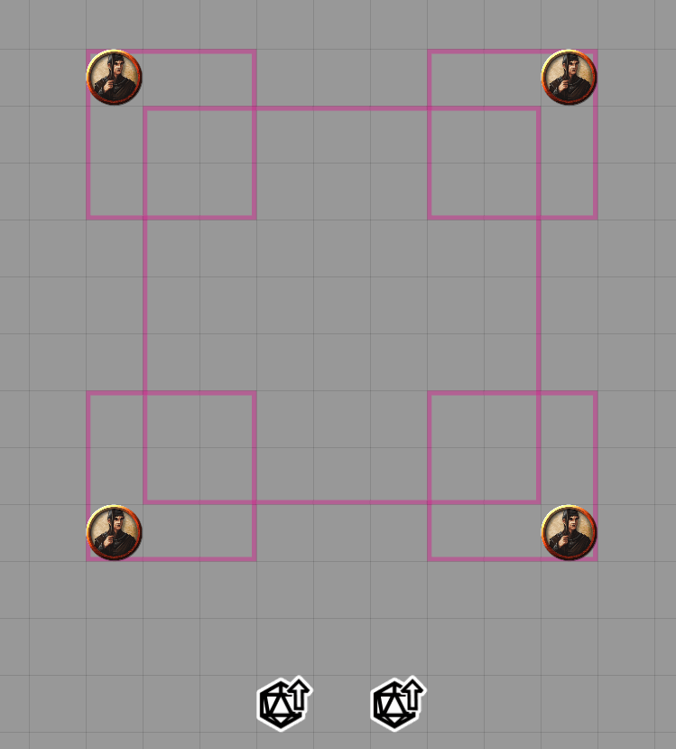
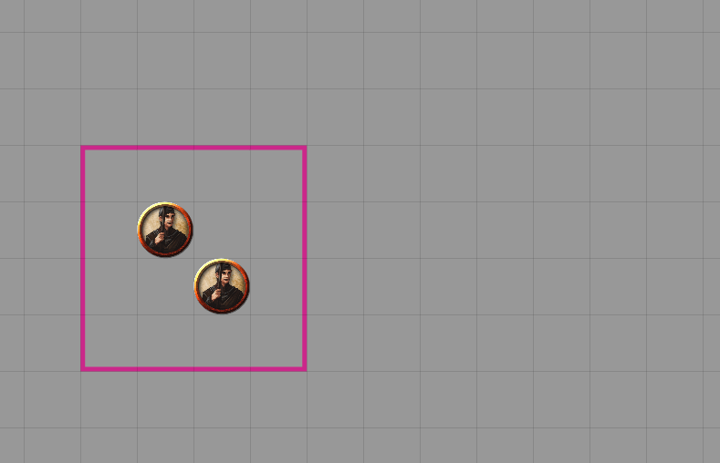
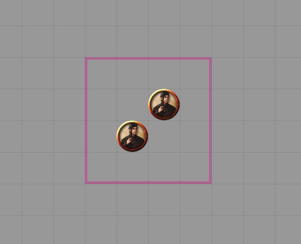
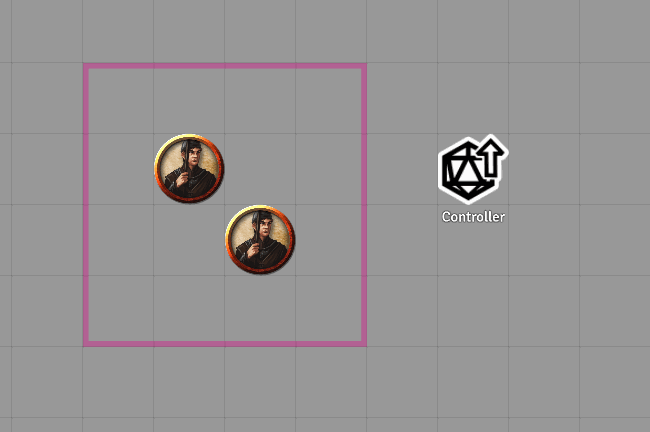
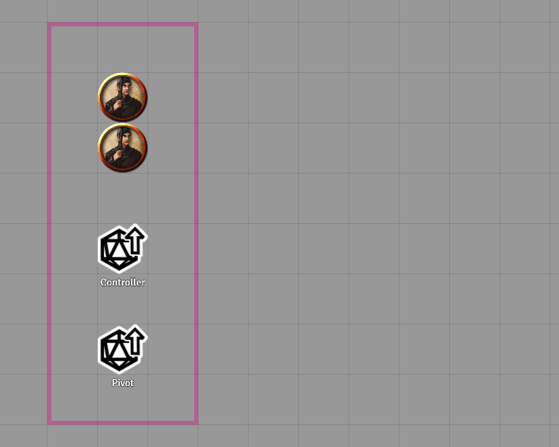
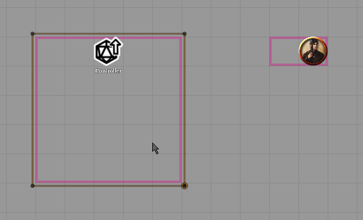

# Vehicles and Mechanisms module for Foundry VTT

This module for FoundryVTT introduces a way to control multiple scene elements (tokens, tiles, walls, and so on) as a single unit, so that they all move and rotate at once. This grouping of elements is referred to as a **vehicle**, but the concept is flexible and can be used for general automation, traps, or other mechanisms with moving parts.

Vehicles can be controlled directly, or remotely, using a special token assigned as a **controller**.

Vehicles are defined using Foundry's built in drawing tools. A new tab in the **Drawing Configuration** window for any rectangle, ellipse or polygon drawing is used to configure vehicle behaviour.



**Note: this module is currently somewhat experimental.** It should be reasonably solid, but there could be some rough edges. You can direct feedback to `grand#5298` on the Discord.

## Installation

You can install this module by searching for it in Foundry's built-in module browser, or with the following public URL:

```
https://raw.githubusercontent.com/grandseiken/foundryvtt-vehicles-and-mechanisms/master/module.json
```

This module depends on the [Multilevel Tokens](https://github.com/grandseiken/foundryvtt-multilevel-tokens) module. Version `1.2.0` of Multilevel Tokens is currently required. Please make sure you have the latest version of both modules installed, or you might run into problems.

Remember to enable the module in the **Manage Modules** menu after installation.

## Basics

* Create a drawing containing the elements you wish to move as a group.
* Double-click the drawing to open the configuration window, and find the **Vehicles** tab.
* Select which types of elements you want to become part of the vehicle using the **Capture** section (see below).
* Moving or rotating the drawing will now move or rotate those elements.



Holding the Alt key allows you to reposition or rotate a vehicle drawing or controller token without also moving captured elements.

Note that, as with Multilevel Tokens, a GM user must be logged in for the module to function.

## Capturing

Vehicles work by **capturing** scene elements. When an element is captured, it will move and rotate with the vehicle. Note that a captured element can still be moved independently, or step off of the vehicle, but will be brought along with the vehicle's movement as long as it remains within the drawing defining the vehicle.


For each type of element (**tokens**, **drawings**, **tiles**, **walls**, **lights** and **sounds**), you can choose between three capture behaviours:

* **None** (the default) means that elements of this type will not be captured by the vehicle.
* **Auto** means that all elements of this type that lie within the drawing defining the vehicle will be captured whenever the vehicle moves.
* **Manual** means that elements of this type can be captured manually using the **Capture Now** button in the drawing HUD (available by right-clicking on the drawing). This button only appears if the vehicle has been configured with at least one **Manual** capture setting. When the button is clicked, all elements of types set to be manually-captured that lie within the drawing will be captured. Manually-captured elements can be released with the **Release All** button in the drawing HUD.

For example, you might use the **Auto** setting for tokens, so that any token that steps onto the vehicle is captured automatically. The drawback of the **Auto** setting is that it could result in unintentional captures, so you need to be a bit careful.

For other elements of the vehicle that should be fixed, the **Manual** setting makes more sense: for example, to create a vehicle that includes walls, you likely want to manually capture the relevant walls once to begin with, and then leave them alone. This way, the vehicle won't start dragging any other walls it encroaches along with it.



For most element types, only the centre-point of the element must lie within the bounds of the drawing in order for the element to be eligible for capturing. _Both_ endpoints of a wall must lie within the drawing for the wall to be captured.

### Capturing drawings

There are two particular reasons why you might want to capture drawings:
* If one vehicle captures a drawing that defines a second vehicle, the second vehicle and all the elements that _it_ captures will also be moved along with everything captured by the first when the first vehicle moves. This allows for vehicles-on-top-of-vehicles or other more complex mechanisms.
* A vehicle can capture a drawing configured with Multilevel Tokens. In theory, this should allow for things like multi-level vehicles.

### Additional capture options

* **Fix token orientation**: if this box is left unchecked, tokens captured by the vehicle will themselves rotate (i.e. their images will rotate) when the vehicle rotates. This might look odd if you use portrait-style tokens. You can check the box to preserve token orientation (but still rotate them into the correct position).
* **Wall collision**: usually, vehicle movement ignores walls. If you check this box, tokens moving on a vehicle can be blocked by walls that are not part of the vehicle. Note that the vehicle itself is not blocked, so this will result in the vehicle sliding past underneath the blocked tokens.

## Controller tokens

As well as moving a vehicle by moving the drawing directly, you can also assign a **Controller token** to a vehicle. Movement and rotation of the controller token will be relayed to the vehicle. This can be used to control a vehicle remotely, to allow your players to control a vehicle (by granting them control of the token), or for other automation purposes.



As with moving the drawing directly, holding the Alt key allows you to reposition or rotate a controller token without also moving any vehicles it controls.

Other advantages of using controller tokens are:
* A single controller token may be associated with multiple vehicles. This allows several vehicles to be controlled at once with a single input.
* The controller token need not be placed within the vehicle itself; it can control the vehicle remotely. It can even be on another scene.
* As opposed to moving the drawing, the way in which a controller token's movement translates to movement of the vehicle can be customized in various different ways (see below).
* The movement of one vehicle can capture the controller token for another vehicle, triggering chain reactions. I am sure somebody will find a way to devise elaborate contraptions.


Enter the exact name of the token you wish to use to control the vehicle into the **Name of controller token** box. Take care, as any token (even on another scene) with this name will become a controller token for the vehicle.

By default, rotation of the controller token will rotate the vehicle about its centre. You can enter the name of a token to use as the pivot point into the **Name of pivot token** box. The closest token with this name to the vehicle will instead be used as the pivot point. You can enter the same name as you used for the controller token to use one token for both purposes.



### Customizing the way in which the controller token controls the vehicle

In the same section, there are several settings that affect the way in which movement of the controller translates to movement of the vehicle.

The **Token control scheme** settings affects which _direction_ the vehicle moves in when the controller token moves. The options are:
* **Absolute** (the default): the vehicle always moves in the same direction that the token moved.
* **Tank**: the direction vector of the token's movement is rotated according the rotation of the vehicle. For example, if the vehicle is rotated 90 degrees clockwise, moving the token upwards will now result in the vehicle moving to the right.
* **Relative**: the direction vector of the token's movement is rotated by the _difference_ between the rotation of the vehicle and the rotation of the token. Roughly-speaking, this means that if the token moves _forwards_, the vehicle will also move forwards, and if the token side-steps, the vehicle will also move to the side.

The **X-coefficient**, **Y-coefficient** and **Angular coefficient** settings affect how _much_ the vehicle moves, or rotates, when the controller token moves or rotates. These are scaling factors applied to movement of the controller token parallel to the X-axis, the Y-axis, and its rotation, respectively, before being translated into movement of the vehicle. They can be any decimal value: values greater than 1 mean the vehicle will move or rotate further than the token did; between 0 and 1 mean it will move or rotate less than the token did; negative values mean the vehicle will move or rotate in the opposite direction. A value of exactly 0 means this type of movement is ignored entirely. This can be used, for example, to create vehicles that move only on a single axis.



# Version history

* **0.2.0**:
  * Added Japanese translation (contributed by Brother Sharp).
  * Fixed minor incorrect behaviour in which a controller token captured by its own vehicle would rotate twice as much as intended when rotated directly by the user.
* **0.1.1**:
  * Basic dependency checking. An error will now be raised if the installed version of Multilevel Tokens is too old.
* **0.1.0**:
  * First version.
